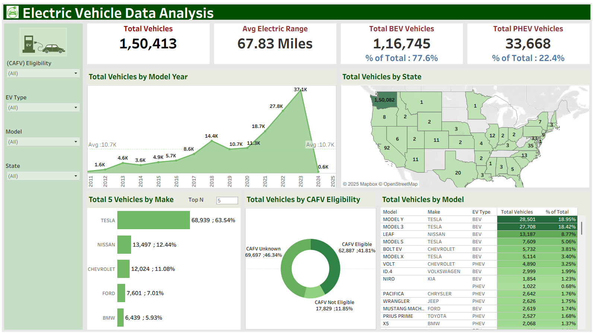

# 🔋 Electric Vehicle Market Analysis Dashboard

## 📘 Overview  
This project explores the **growth and distribution of Electric Vehicles (EVs)** across the United States from **2011 to early 2024**.  
The goal is to identify adoption trends, leading manufacturers, and the market shift towards sustainable transportation through **interactive Tableau visualizations**.

---

## 🎯 Objectives  
- Analyze the growth of EV adoption over time  
- Compare market share between **Battery Electric Vehicles (BEVs)** and **Plug-in Hybrid Electric Vehicles (PHEVs)**  
- Identify **top manufacturers and models** dominating the EV market  
- Examine **Clean Alternative Fuel Vehicle (CAFV)** eligibility distribution  
- Visualize EV distribution across states  

---

## 📊 Dashboard Features  

**KPIs:**  
- Average Electric Range  
- Total EVs  
- Total BEVs  
- Total PHEVs  

**Visuals Used:**  
- 📈 Line + Area Chart – Total Vehicles by Model Year  
- 🗺️ Map Chart – Total Vehicles by State  
- 📊 Horizontal Bar Chart – Total Vehicles by Make (Top N)  
- 🍩 Donut Chart – Vehicles by CAFV Eligibility  
- 🧾 Data Table – Vehicles by Model with % of Total  

**Filters:**  
EV Type | CAFV Eligibility | Model | State  

---

## 🧠 Key Insights  
- EV adoption shows **steady growth** year over year (2011–2024).  
- **Washington** leads in total EV registrations.  
- **BEVs account for 77%** of total EVs, while **PHEVs make up the rest**.  
- **Tesla, Nissan, and Chevrolet** are the top 3 manufacturers.  
  - Tesla focuses solely on BEVs — *Model Y* and *Model 3* dominate.  
  - Nissan’s performance fluctuates, led by the *Leaf* model.  
  - Chevrolet produces both BEVs and PHEVs with varying yearly trends.  
- **41% of vehicles are CAFV eligible**, 11% not eligible, rest unknown.  

---

## 🧰 Tools & Technologies  
- **Tableau Public** – for dashboard creation and visualization  
- **Python (Pandas)** – for dataset exploration and validation  
- **MS Excel / CSV** – for dataset handling    

---

## 🗂️ Dataset  
The dataset includes information about registered electric vehicles in the U.S.  
Columns include:  
`VIN (1–10)`, `Make`, `Model`, `Model Year`, `Electric Vehicle Type`,  
`Electric Range`, `Base MSRP`, `CAFV Eligibility`, `State`, `City`, `County`, `Electric Utility`, etc.  

> *Note:* Data available up to **early 2024**; later 2024 entries may not be fully represented.

---

## 📈 Dashboard Preview  

---

## 🔗 View Live Dashboard  
👉 [View on Tableau Public](https://public.tableau.com/app/profile/riya.manoj)

---

## 📄 Project Presentation  
📘 [Download Project Presentation (PPTX)](Electric_Vehicle_Data_Analysis.pptx)

---

## 👩‍💻 Author  
**Riya Manoj**  
Data Analytics Enthusiast | Tableau | Python | SQL  
📧 [riya.m.manoj.com]  
🔗 [LinkedIn Profile](https://www.linkedin.com/in/riya-manoj-/)

